<h1 align="center">Hola 👋🏻, Soy Luciano Heitt</h1>
<h3 align="center">Un apasionado Desarrollador Full Stack Argentino de Corazón 💙🤍💙</h3>

&nbsp;
<h4>Desde muy chico siempre me he sentido atraido hacia el mundo de la tecnología en general. Empezando por la electrónica, la informática, la creación de contenido digital y ahora finalmente la programación y el desarrollo web!</h4>

&nbsp;
<h1 align="left">⭐ Lenguajes y herramientas que manejo</h1>

 
    <!--- javascript -->
    
    <!--- html5 -->
    
    <!--- css3 -->
    
    <!--- reactjs -->
     
    <!--- reactnative -->
     
    <!--- redux -->
    
    <!--- webpack --> 
     
    <!--- Bootstrap -->
     
    <!--- sass -->
    
    <!--- tailwind -->
    
    <!--- nodejs -->
    
    <!--- express -->
    
    <!--- firebase -->
    
    <!--- postgresql -->
    
    <!--- sqlite --> 
    
    <!--- jest -->
    
    <!--- mocha -->
    
    <!--- git -->
    
    <!--- postman -->
    
    <!--- heroku --> 
    
    <!--- photoshop -->
    
    <!--- figma -->
     
    <!--- Blender -->
    

&nbsp;
<h1>📌 Proyectos en los que he trabajado</h1>
<h2 align="center">Videogames App</h2>
<h4>SPA creada durante el bootcamp de Full Stack Developer la cual gracias a la API RAWG permite obtener los detalles de un videojuego en particular de entre +500.000 y agregar nuevos a una base de datos.
Cuenta además con una barra de búsqueda, la posibilidad de ordenar los videojuegos mostrados ascendente o descendentemente dependiendo de su nombre o rating y también la de poder filtrarlos por géneros o por origen (API o DB).
Se uso PostgreSQL y Sequelize para la Base de datos, Node.js y Express para el Backend y React.js acompañado de Redux para el FrontEnd con CSS puro.</h4>
&nbsp;

    <a>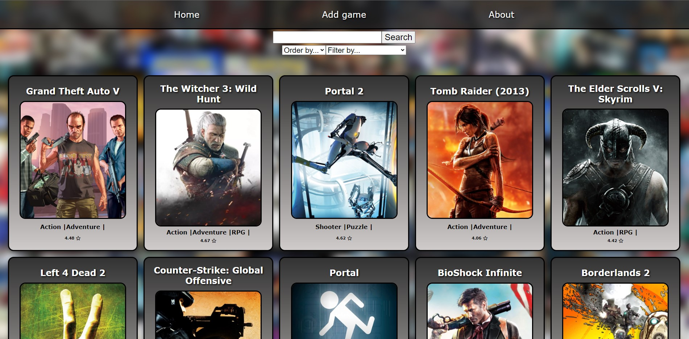</a>
    <a>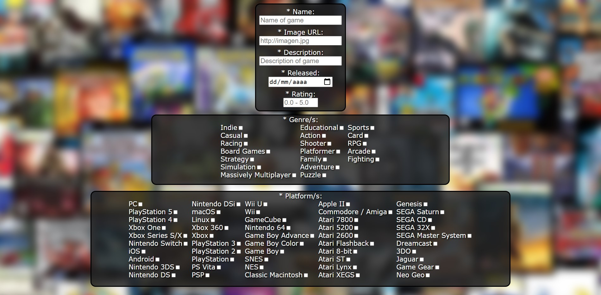</a>

    <a>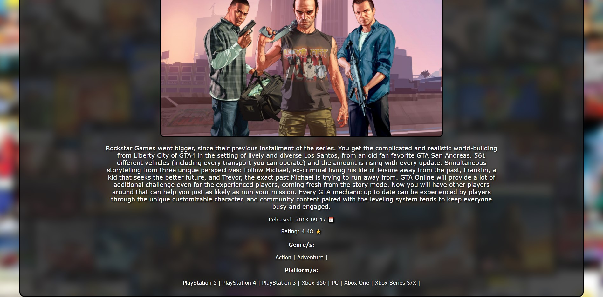</a>

    <a href="https://github.com/lheitt/PI-Videogames">Ver Repositorio</a>
    <a>ㅤㅤ</a>
    <a href="https://pi-videogames-lh.vercel.app">Ver Deploy</a>

&nbsp;
<h2 align="center">PocketFit App</h2>
<h4>Proyecto destinado a las administración de un gimnasio desarrollado durante el bootcamp de Henry por 7 personas el cual se divide en dos plataformas: web y mobile. La web orientada hacia la administracion con la posibilidad de gestionar el plan semanal del gimnasio, los turnos, las clases, los eventos, los usuarios, el feedback y hasta un newsletter. Y la mobile orientada hacia el cliente con la posibilidad de visualizar su plan semanal, estadísticas, eventos y feriados próximos del gimnasio, editar su perfil, dar feedback y hasta poder pagar su mensualidad a través de la app.
Se uso PostgreSQL y Sequelize para la Base de datos, Node.js y Express para el Backend y React.js, React Native acompañado de Redux para el FrontEnd con Styled Components.</h4>
&nbsp;

    <a>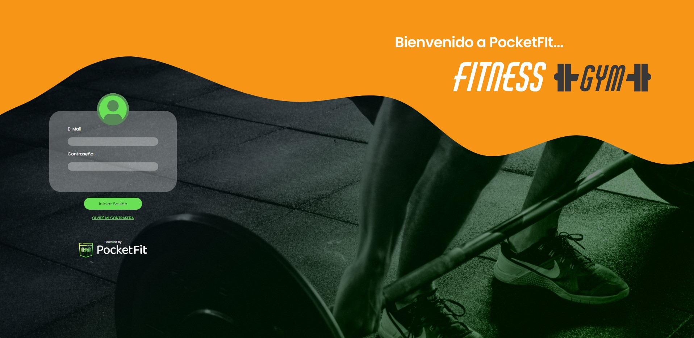</a>
    <a>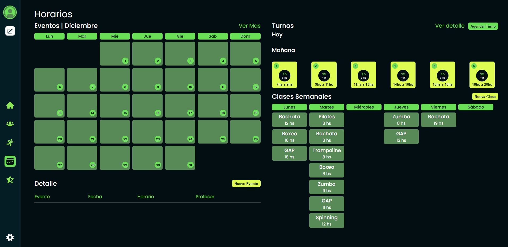</a>

    <a>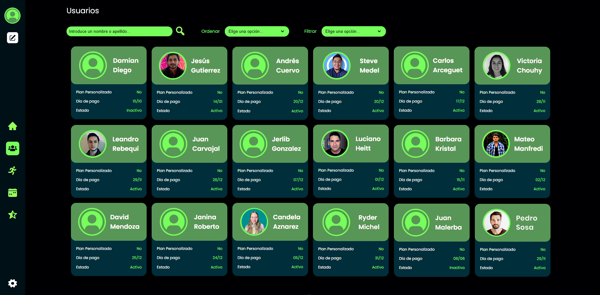</a>
    <a>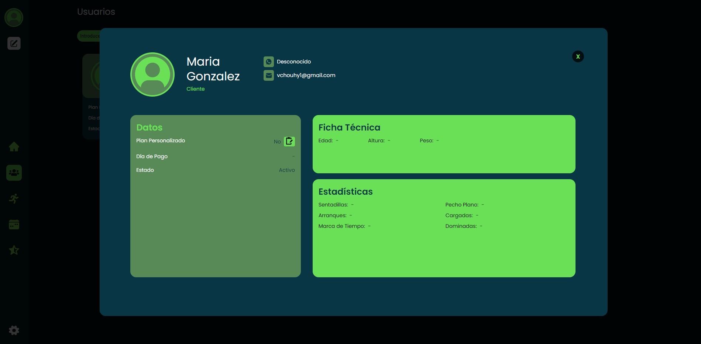</a>

    <a>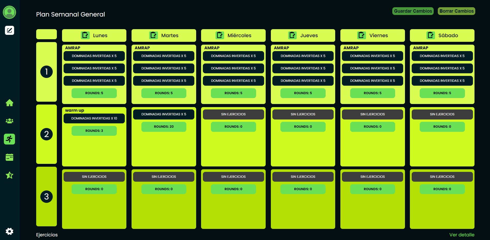</a>
    <a>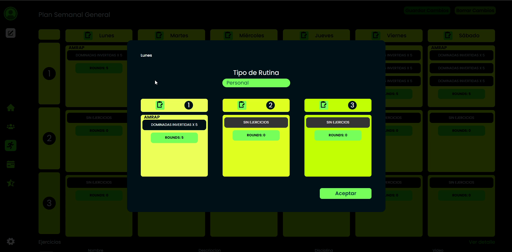</a>

    <a>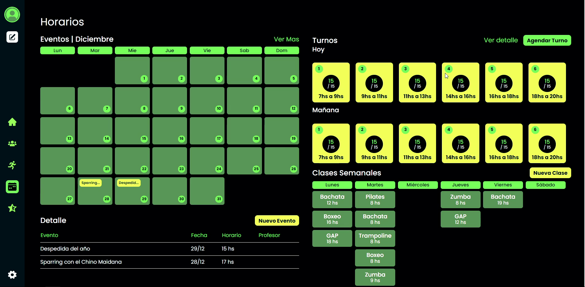</a>
    <a>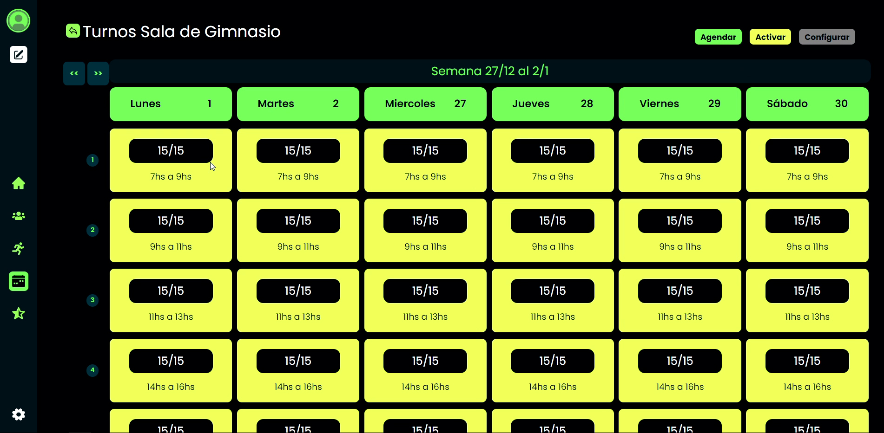</a>

    <a>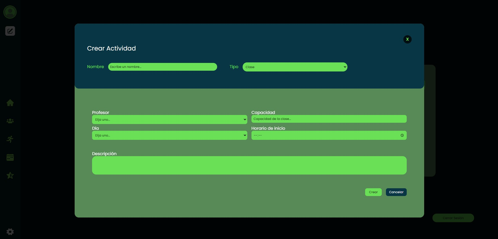</a>
    <a>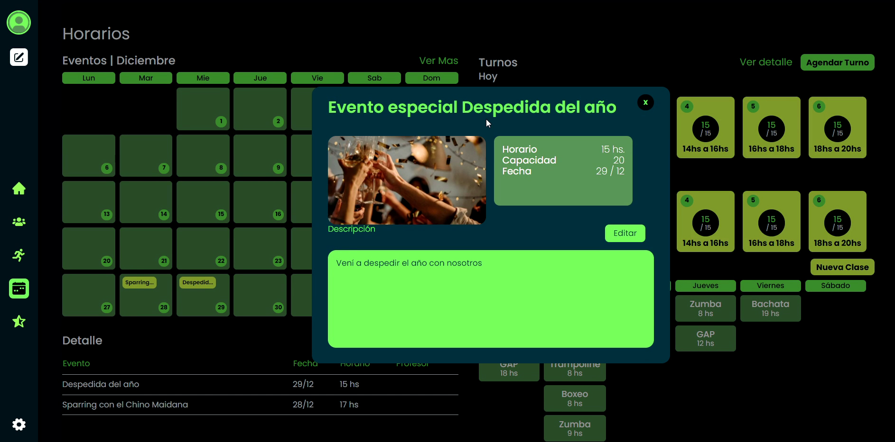</a>

    <a>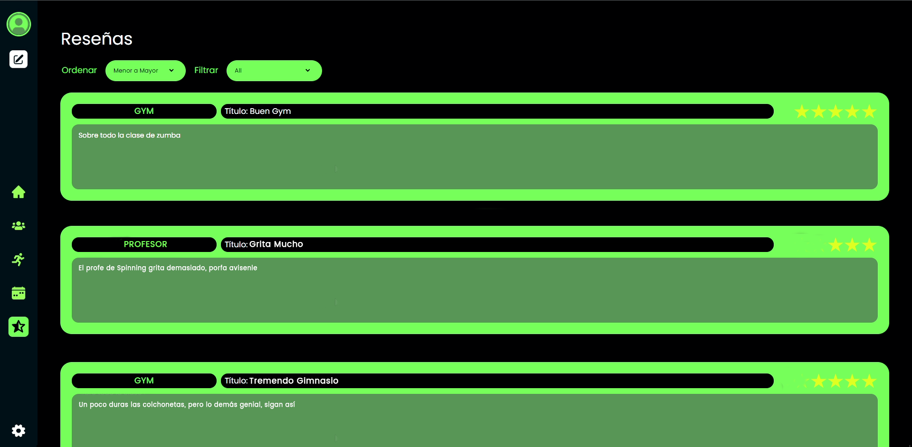</a>
    <a>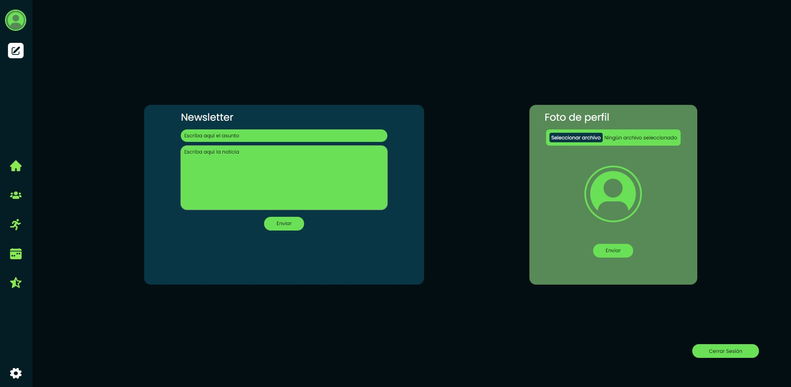</a>

    <a>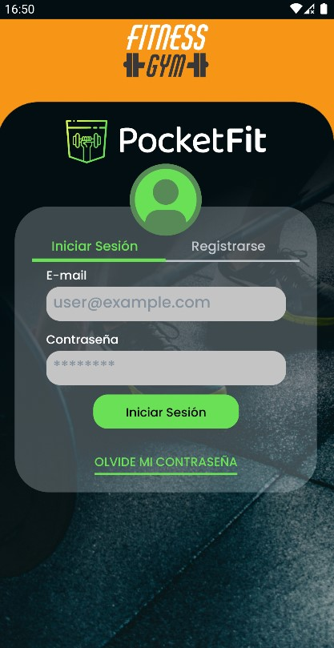</a>
    <a>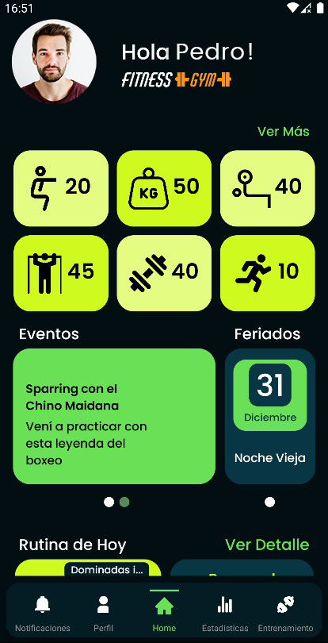</a>
    <a>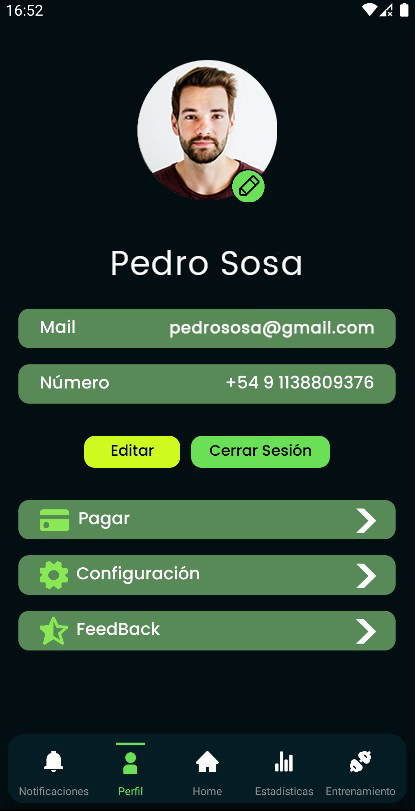</a>
    <a>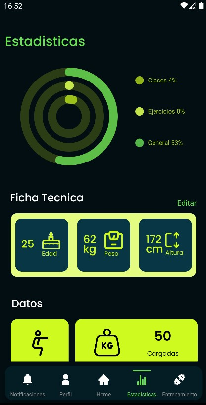</a>
    <a>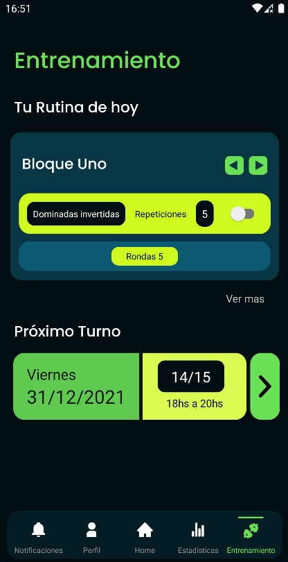</a>

    <a href="https://github.com/ManfredMat/PocketFit">Ver Repositorio</a>
    <a>ㅤㅤ</a>
    <a href="https://pocketgym.vercel.app/session/home">Ver Deploy Web</a>
    <a>ㅤㅤ</a>
    <a href="https://expo.dev/@lheitt/pocketfit">Ver Deploy Mobile (con Expo Go)</a>

&nbsp;
<h1>📫 Contacto</h1>

    <a href="mailto:lheitt@gmail.com">lheitt@gmail.com</a>

